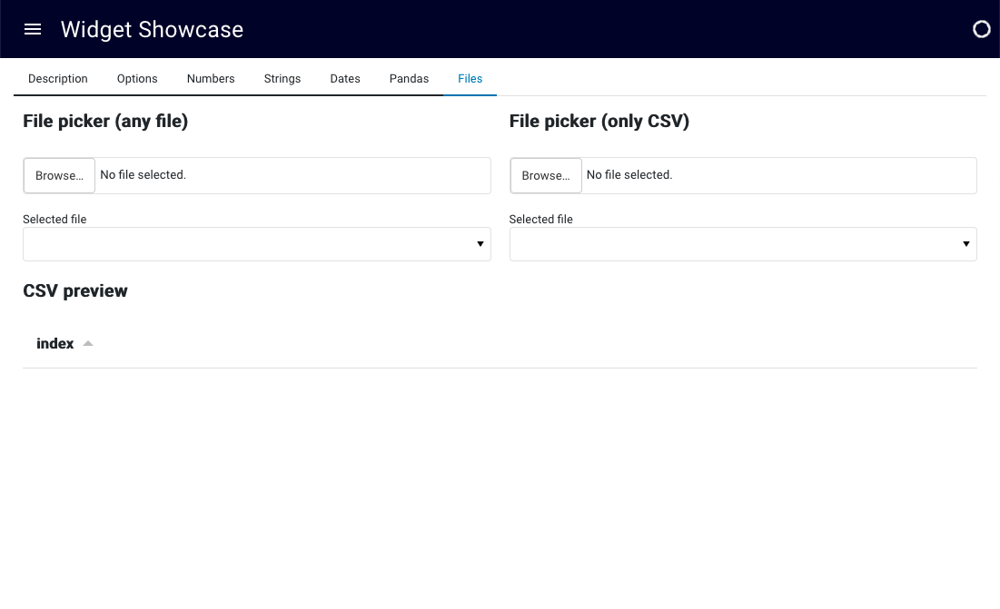
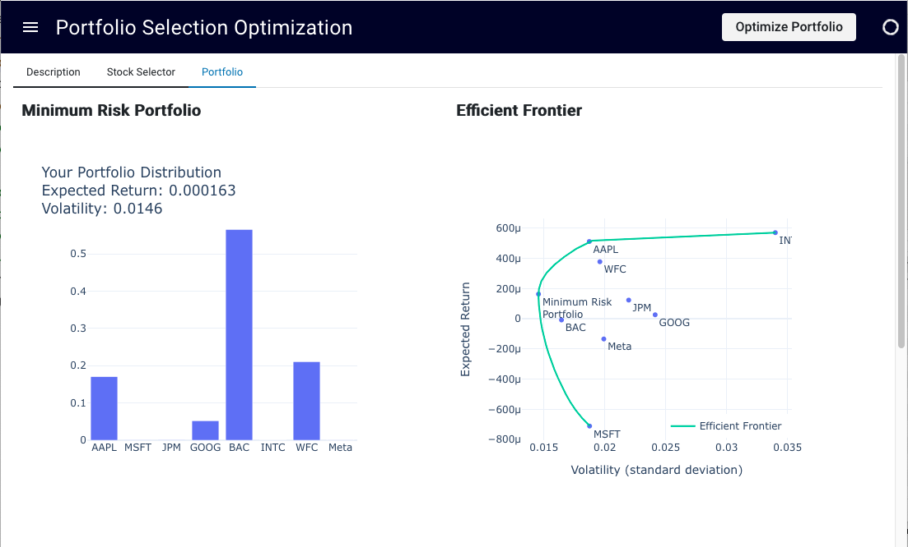
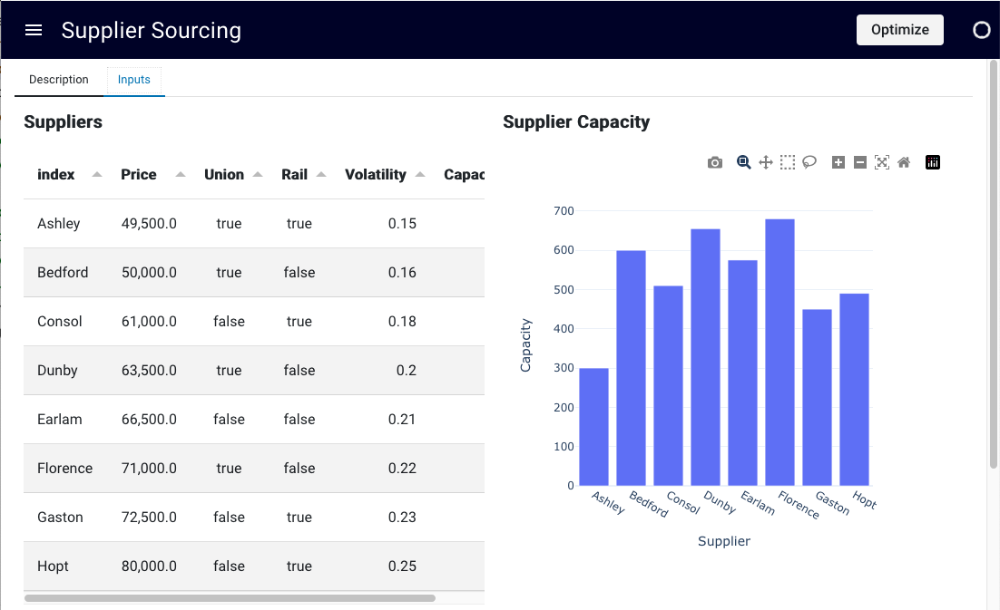
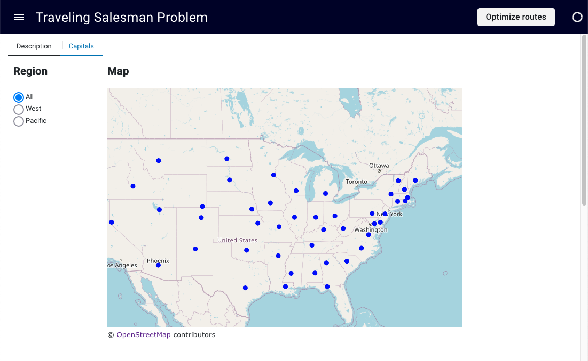
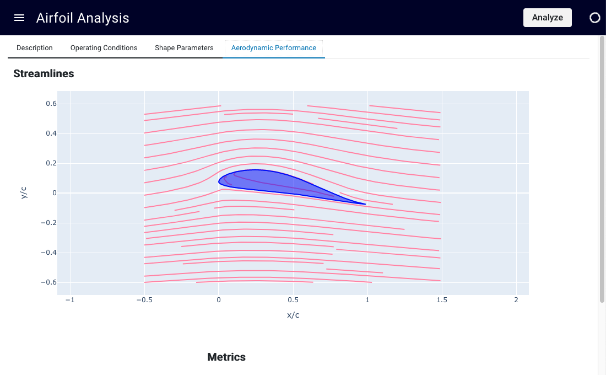
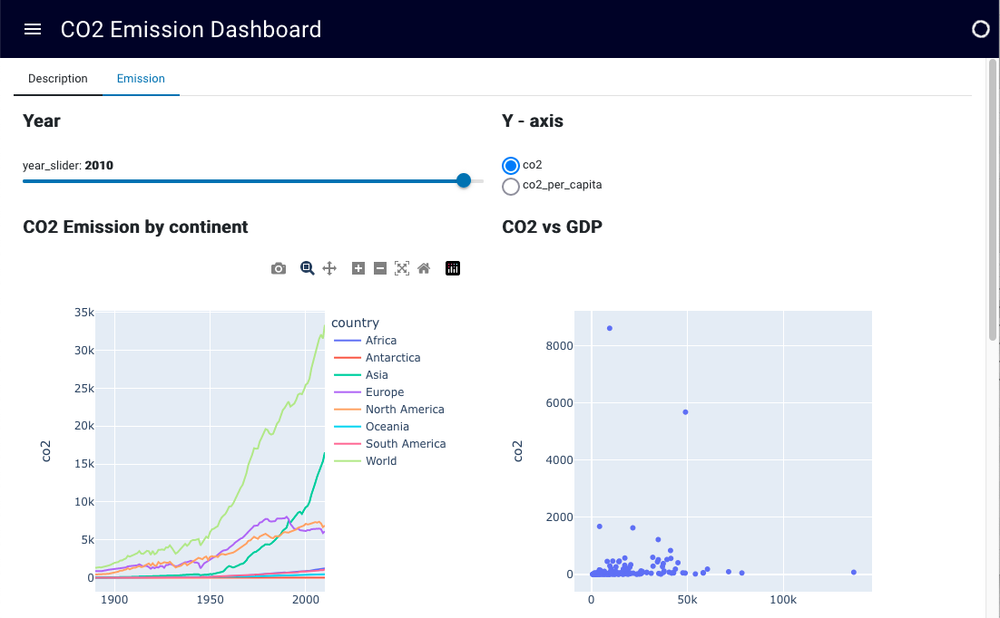

# GitHub Codespaces 🪨 Manganite 

Welcome to your shiny new Codespace running Manganite! We've got everything fired up and running for you to explore Manganite.

We provide some simple examples to get started with the package and explore the capabilities.
Everything you do here is contained within this one codespace. There is no repository on GitHub yet. If and when you’re ready you can click "Publish Branch" and we’ll create your repository and push up your project. If you were just exploring then and have no further need for this code then you can simply delete your codespace and it's gone forever.

To run this application:

```
mnn serve --autoreload [name of your notebook].ipyn
```

There is no repository on GitHub yet. While your codespace will remain active for quite a while, Github deletes it after a period of inactivity. Once your codespace is deleted, all your changes are gone forever.  Therefore, if and when you’re ready click "Publish Branch" and Github will create create your repository and push up your project, so that your own changes are stored and saved. 

# Gallery

Welcome to our image gallery! Below are examples of our work.

These examples are hosted on [Hugging Face](https://huggingface.co) for your convenience.

| [](https://huggingface.co/spaces/daniel-dobos/widget_demo_manganite) | [](https://huggingface.co/spaces/daniel-dobos/portfolio_optimisation_manganite) |
| -------------------------------------------- | -------------------------------------------- |
| [](https://huggingface.co/spaces/daniel-dobos/Supplier_Selection_Dashboard_manganite) | [](https://huggingface.co/spaces/daniel-dobos/Traveling_Salesman_manganite) |
| [](https://huggingface.co/spaces/daniel-dobos/Airfoil_analysi) | [](https://huggingface.co/spaces/daniel-dobos/CO2_dashboard) |